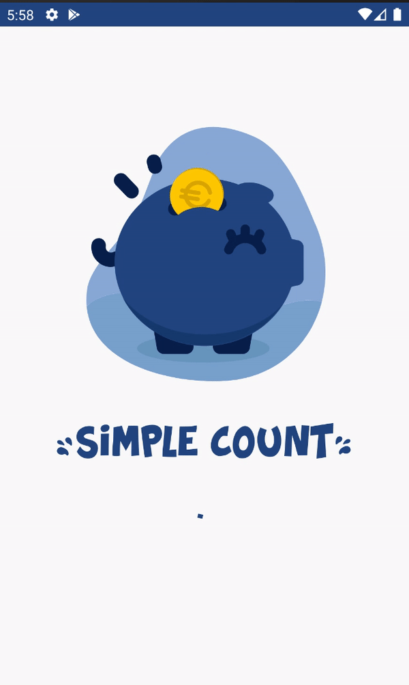

# :dollar: Simple Count

An Android App to help users to handle group expenses more efficiently by minimizing cash flows among people in group.

The app was written in Kotlin and using RxKotlin and RxBinding to observe and handle Edittext changes

  

| What the app do                                                                                                                                 | Complete |                   Image                       |
| ------------------------------------------------------------------------------------------------------------------------------------------------| :------: | :-------------------------------------------: |
| Event creation with title, description and participants                                                                                         | :dollar: |     |
| Expense creation with title, amount, date, payer and participants. Allow users to handle the portion as well as amount they spent in an expense | :dollar: | |
| Calculate the amount users have to pay each other and live update it after the expenses created                                                 | :dollar: | |
                                     

## Libraries

### Jetpack

| Library      | Use                                                                           |
| ------------ | ----------------------------------------------------------------------------- |
| Data Binding | For accessing XML layouts without findViewById()                              |
| Live Data    | For observing changes in Fragments                                            | 
| Room         | For storing app data into the database                                        |
| ViewModel    | For MVVM architecture                                                         |

### Third Party

| Library    | Use                                                          |
| ---------- | ------------------------------------------------------------ |
| Gson       | For converting complex data into string to store in database |
| Coroutines | For asynchronous calls                                       |
| Lottie     | For app icon animations                                      |
